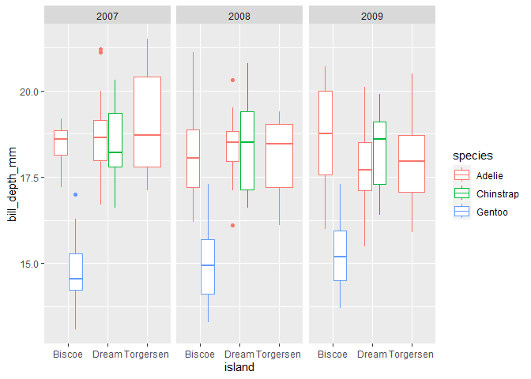
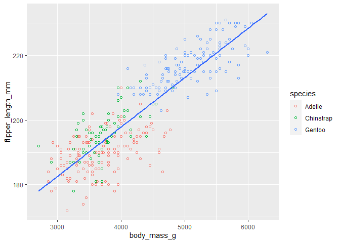
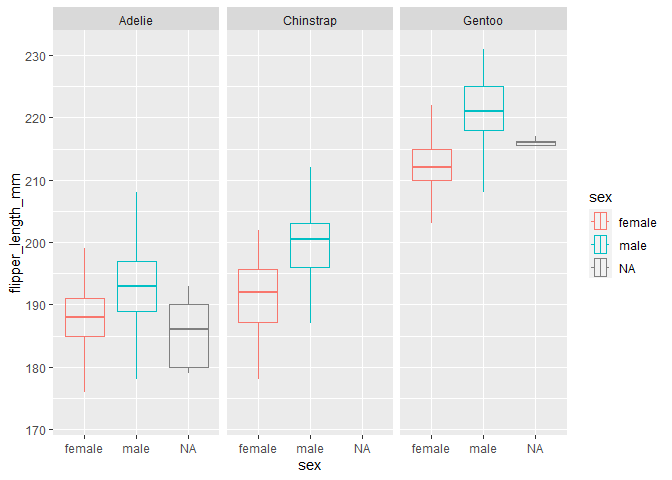

Penguins Data Markdown
================
Sarah Lawhun
2023-02-09


### Data

``` r
library(palmerpenguins)
library(tidyverse)
```

    ## ── Attaching packages ─────────────────────────────────────── tidyverse 1.3.2 ──
    ## ✔ ggplot2 3.4.0      ✔ purrr   1.0.1 
    ## ✔ tibble  3.1.8      ✔ dplyr   1.0.10
    ## ✔ tidyr   1.3.0      ✔ stringr 1.5.0 
    ## ✔ readr   2.1.3      ✔ forcats 0.5.2 
    ## ── Conflicts ────────────────────────────────────────── tidyverse_conflicts() ──
    ## ✖ dplyr::filter() masks stats::filter()
    ## ✖ dplyr::lag()    masks stats::lag()

``` r
?
view(penguins)
```

``` r
dim(penguins)
```

    ## [1] 344   8

``` r
colnames(penguins)
```

    ## [1] "species"           "island"            "bill_length_mm"   
    ## [4] "bill_depth_mm"     "flipper_length_mm" "body_mass_g"      
    ## [7] "sex"               "year"

### Single trait distribution

``` r
ggplot(data = penguins) + 
  geom_boxplot(mapping = aes(x = island, y= bill_depth_mm, color = species)) +
  facet_wrap(~year)
```

    ## Warning: Removed 2 rows containing non-finite values (`stat_boxplot()`).

<!-- -->

### Relationship between multiple traits

    ## `geom_smooth()` using formula = 'y ~ x'

    ## Warning: Removed 2 rows containing non-finite values (`stat_smooth()`).

    ## Warning: Removed 2 rows containing missing values (`geom_point()`).

<!-- -->

### Sexual dimorphism

``` r
penguins %>%
  ggplot(mapping = aes(x=flipper_length_mm, y=sex, color=sex)) +
  geom_boxplot(outlier.alpha = 0, alpha=0) +
  coord_flip() +
  facet_wrap(~species)
```

    ## Warning: Removed 2 rows containing non-finite values (`stat_boxplot()`).

<!-- -->
